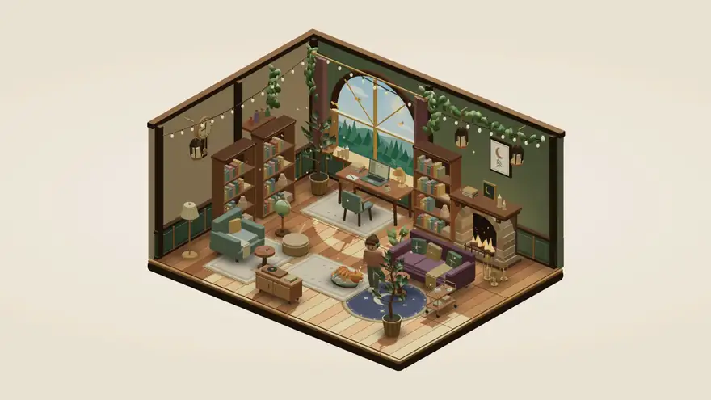

# Little Hours

A browser-first cozy room-decorating study game, built with Babylon.js and procedural JavaScript furniture. Working title only.



## Run

Use **Node.js 24** (recommended) and its bundled npm. Run these commands from the repository root:

```sh
npm ci
npm run dev
```

The development server binds to `127.0.0.1`. Open the local URL Vite prints. Run `npm run build` to create the production bundle in `dist/`, then `npm run preview` to preview it locally.

## Play and decorate

- **House** opens a miniature cottage that grows with your focus time. Start with your furnished studio, earn one coin per completed focus minute, build the garden wing for 25 coins, then the upstairs hideaway for 75. Choose any of the six furnished designs for each new space. Name your house and rooms, enter them from the model or room buttons, and decorate each independently. Your current room and past completed sessions carry into the house when an older save is opened.
- **Dream up a room** in the house's paper builder: try six furnished interiors directly in the dollhouse, compare before/after, tap **Surprise me**, and give the room a name before building. Each room plan keeps its name and design while you browse or return from a focus session. A welcome note and little petal burst celebrate a finished extension. The garden has a flower border, blossom pots and a tiny bench; turn/reset buttons let you see it from different angles.
- **Make a postcard** previews a 1600 × 1200 PNG of the house with its name, ready to save and send. Unbuilt room previews are labeled as daydreams on the postcard. Everything is generated locally in the browser; nothing is uploaded.
- A spacious orthographic fantasy retreat with an arched forest window, deep timber floors, climbing greenery, candles, lanterns, layered rugs and a resident pet.
- **Decorate** opens a collection of thirty-eight original JavaScript-modeled pieces, including study stations, a glowing fireplace, a cushioned daybed, moonleaf trees, lanterns, patterned rugs, bookshelves and smaller comforts, a little aquarium, a floor globe, a painter's easel, a bean bag, a Swiss cheese plant and a tea cart, and fourteen **Wall decor** pieces: three picture frames, a moon clock and a round wall clock that keep the local time (Sakura studio, Cloud loft and Midnight metro hang the wall clock), a potion shelf, a book shelf, a trailing planter, two cloud shelves, a blossom scroll, a neon sign, a framed record and a felt rainbow, and three windows.
- **Decorate** keeps the collection in a bottom tray. Hover furniture to highlight its outline, then drag it to a new spot. Drag empty space to turn the room. Drag a piece over the collection to see a faded piece and dashed return preview; release to put it away. **Undo** restores the last move or removal. Invalid drops and `Escape` return the piece to where it started.
- Wall pieces hang on the back wall or the side wall. Drag one along a wall or across the corner; the arrow keys and buttons move it up, down, left and right in 10 cm steps, and it never turns. Select a frame to pick one of seven pictures, or a framed record to pick its sleeve; Undo restores the last choice.
- **Windows** (a cottage window, an arched window and a round window) cut a real opening in their wall. Daylight falls through them onto the floor and furniture, with the frame's shadow, and the room's own view shows behind them; a side-wall window also lets moonlight in at night. A window being dragged closes its opening until it is dropped.
- **Curios**: the aquarium's three fish swim and turn around among sea grass and bubbles, and a tap switches its lid lamp; a tap spins the globe once; the easel shows a picture of your choice, like the frames. A tap puffs steam from the tea cart's teapot, squashes the bean bag and rustles the Swiss cheese plant. With reduced motion the fish keep still.
- **Colors**: a selected daybed, lounge chair, ottoman, rug, moon rug, bookcase, record cabinet, floor lamp, plant, bean bag or Swiss cheese plant offers three colors in the inspector, next to its room colors. The piece keeps its color after a reload and in its saved room; its other parts keep the room design's colors, and **Reset layout** gives the room colors back.
- **Walls and floors**: with nothing selected, the inspector offers each design's own walls and floor and three more of each: the timber retreat has rose, dusk-blue and honey walls and walnut, pale-oak and grey-ash boards; Sakura studio has blossom, matcha and wisteria plaster and fresh, golden and smoked tatami; Cloud loft has mint, peach and sky walls and three checkerboards; Midnight metro has red, painted and bottle-green brick and clay, concrete and ink tiles. Every saved room keeps its own choices.
- Choose a collection item, move over the floor (or a wall, for wall decor and windows) and click a valid spot to add it. Click a piece to select it; a click on empty floor deselects it, and the arrow keys or inspector buttons move it. `R` rotates (including during a drag), and `Escape` cancels. The last study desk stays in the room.
- Solid furniture stays inside the room and cannot overlap other solid furniture or the pet's bed. A drop, placement or turn on a blocked spot lands on the closest free spot within four grid steps; only when none is that close does the piece go back. Rugs can sit under furniture and on each other: the rug put down last lies on top, and a covered rug flattens so its weave never shows through. Wall pieces keep clear of windows, posts, curtains, vines, lanterns and ceiling lamps, of each other, and of solid furniture: a bookcase cannot stand within 50 cm in front of a picture at its height, and a picture cannot hang behind one.
- **Rooms** opens six editable designs. **Sakura studio** has shoji screens, tatami and cherry blossoms; **Cloud loft** has a round window, pastel checkerboard and cloud shelves; **Midnight metro** has exposed brick, steel windows and a neon city view. **Ember library**, **Moonlit greenhouse**, and **Writer’s loft** retain the original timber retreat.
- Each room keeps its own furniture arrangement and active study desk in this browser. Switch away, decorate another room, and return later. **Reset layout** restores that design; **Undo** brings your previous arrangement back. Daylight, night and rain work in every design without interrupting your timer.
- Select a desk and choose **Study here** to move your avatar's study spot. The last study station cannot be removed.
- 25 / 50 / 90-minute focus sessions, pause/resume/reset, local saves, task text and completed-session history.
- A visible local presence badge distinguishes **In your room**, **Focusing**, and **On a break**. It reflects your timer; shared online/friend presence is a future feature.
- Your companion follows a routine: **working → walking → resting → dozing**. Pause or finish a focus session and they leave the desk: first they do one small thing in the room (warm their hands at a lit fire, water a plant, put on a record, look out of the window, kneel to pet your pet or, at night, switch on an unlit floor lamp), then they sit on a reachable sofa, armchair or pouf. In the armchair they read a book. After 30 seconds of rest they doze with slow breathing and little floating Zs; resume to bring them back to work. A separate companion status shows what they are doing.
- The companion says a short line in a bubble at the edges of focus: when a session starts, resumes, pauses or ends, when they sit down to rest or doze off, and when you come back after half an hour or more away. Tap them to hear what they are up to. They stay quiet while you focus unless you tap them, never speak in Decorate or the mini view, and speak on their own at most once every twelve seconds.
- Your pet, **Miso** the ginger cat or **Mochi** the puppy (choose in the pet panel on the room toolbar; the choice is saved), naps in a soft bed that you can move in Decorate like any piece (it always stays in the room and never counts as a piece). Between naps the pet wakes with a stretch, strolls to a favorite spot (a lit fire, the window, a rug, beside the desk or at the companion's feet), sits or loafs a while, then walks home, turns once around and lies down. Small, faint "z" letters float up while it sleeps.
- Tap the pet for a pet: it wakes, leans into your hand, closes its eyes, a heart pops up and a short line appears in a bubble just above it. Drag the pet to carry it; set it down anywhere and it looks around for a moment, then walks home. A pet set down in a corner that furniture closes off lands on the nearest floor from which it can still walk home.
- Walking routes leave clearance around furniture and the pet's bed. Crowded rooms fall back to a desk break. Decorating anchors the companion at the active desk; reduced motion goes straight to the settled pose, and hidden tabs pause the walk.
- Drag to orbit through wider side views and elevations from 15° to 67.5°. The room stays framed; **Reset room view** returns to the original composition.
- Animated hearth flames and rising embers, curling tea steam, connected typing/writing gestures and thinking pauses, a breathing, strolling pet with petting reactions, swaying leaves and hanging lanterns, ticking clock hands, a swinging pendulum, a turning record, twinkling fireflies, drifting window stars, fluttering moths, occasional shooting stars, rain and a gentle settling motion when furniture is placed. Reduced motion returns the scene to still poses.
- A sun/moon button switches between **Daylight** and **Night**. Daylight brings a blue sky, clouds, green hills and sunlight through the window; night brings moonlight, stars and warm pools of lamplight. The choice is saved. **Atmosphere** also offers a rainy afternoon, plus the fairy-light toggle.
- Outside Decorate, tap a floor lamp, a desk, the wandering lanterns, the hearth or the record cabinet to switch its lamp, candles, fire or record; each room remembers what is off, and switching is never an Undo step. The fairy lights and ceiling lamps switch the same way and stay in place, unlit, when off. Plants rustle, a book tips out of the bookcase, seats squash and tea puffs steam when tapped. A soft outline and the pointer cursor show what a tap will use.
- Pet interaction and user-activated synthesized rain audio.
- Mini view demonstrates a smaller room **inside this page**.
- An optional Performance panel shows measured frame cadence, CPU submission, drawing cost and quality controls.
- Buttons press in softly and spring back, the room's own buttons lift a little under a mouse, a choice that turns on settles into place, the Night and Daylight icon turns, and panels ease in. Reduced motion keeps them still.

All furniture and design changes remain free; earned coins buy the two house extensions. There are no real-money purchases. This is an early playable prototype with no accounts, cross-device sync, multiplayer, native always-on-top window, notch integration or coding-agent integration. No competitor code, models or music are included. The furniture, room geometry and decorative details are authored in JavaScript; no generated raster furniture assets or Blender files are required. Google Fonts is the only external presentation request; fallback fonts work without it.

### Whole-house view

Choose **Whole house** above the room to see your furnished home together. **Open floors** brings the upstairs room out beside the ground floor on desktop, or lifts it clear on a phone; **Dollhouse** folds it back. Drag to turn, use the view buttons, or choose a room’s name to step inside. The larger room framing keeps the whole cutaway visible. See [whole-house notes](docs/whole-house.md).

## Engine and art

[Babylon.js](https://www.babylonjs.com/games/) provides the game engine, scene, orthographic camera, picking and rendering. Furniture models live in `src/furniture.js`, the collection in `src/catalog.js`, room placement/presets in `src/layout.js`, wall shells and wall placement in `src/walls.js`, the frame pictures in `src/art.js`, the furniture color choices in `src/tints.js`, the wall and floor choices in `src/surfaces.js`, and the new room architecture, procedural window views and furniture palettes in `src/architecture.js`. The runtime reuses geometry and materials and batches static geometry to limit drawing work.

See [engine and performance notes](docs/engine-and-performance.md) for the baseline, measurement definitions and validation limits. A frame-rate measurement on one machine is not a guarantee across every browser or device.

## Product research

Start with [the competitor map](research/competitor-map.md), then [web and social](research/web-and-social.md) and [desktop and notch](research/desktop-and-notch.md). Research was checked September 21, 2026. Official feature claims are not equivalent to hands-on verification.

The chosen direction is browser first, with a whole cutaway room visible like Rooms.xyz, then friends joining rooms and clearly visible study presence. The notch is an optional companion to that experience. See [product direction](docs/product-vision.md). Virtual Cottage 2 is the main product benchmark under that framing; Rooms is the visual reference. The competitive opportunity remains a hypothesis to validate through actual sessions.

## Verification

```sh
npm test
npm run verify:room
npm run build
```

`npm test` covers wall-clock sessions, expiry accounting, storage failure, cross-tab edits, saved-layout migration, house rewards and purchases, independent rooms, placement rules, presets and procedural furniture bounds.

The development-only `/checks/house.html` page runs the real app with a separate session save and clock controls. Use it to check earning and spending coins without changing your own room or waiting through a session. It also measures idle overview frames and background room frames. It is not included in the production bundle.

See [growing house notes](docs/growing-house.md) for save behavior, rendering limits and the browser verification results.

`npm run verify:room` imports the production runtime into Babylon's **NullEngine**. It exercises the real scene graph, camera math, editor operations, reduced motion and lifecycle cleanup without a GPU. Browser checks separately cover appearance, frame rate, placement/picking, themes, pet interaction, mini view, audio, timer controls, refresh restoration and keyboard use. Native touch scrolling still needs physical-device testing.

[GitHub Actions](.github/workflows/ci.yml) runs dependency installation, both test commands and the production build on pushes and pull requests using Node.js 24.

## Proposed next milestones

1. Refine the furniture art and room game with the user; validate the placement flow at desktop and mobile sizes.
2. Validate the three-room progression loop and tune extension prices with players; expand the deliberate furniture collection, room shapes and palettes.
3. Validate repeat use with a small pilot. Measure time to first focus session, repeat completed sessions, and observed memory/frame/battery performance.
4. Add invite-only study visits with visible presence: distinguish online availability, active focus and breaks. Synchronize room and focus state for invited friends.
5. Add an optional expandable native Mac notch/desktop companion using that same room, pet, focus and presence state. Show which friends are studying and let the companion expand into their rooms. This needs native implementation and device testing.
