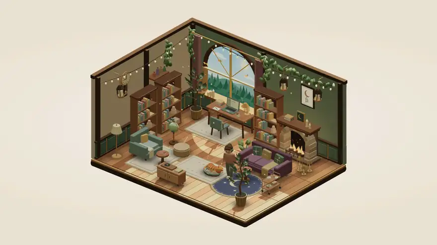

# Little Hours

A browser-first cozy room-decorating study game, built with Babylon.js and procedural JavaScript furniture.



## Personal companions

Pets now have custom names, favorite rituals, a lasting bond, and a memory of your focus time together. Cuddle, play with a little ball, offer a treat, invite them beside your desk, and earn wearable ribbons at bond milestones. Set an adoption wish and save a personal portrait with your name or both of your names. A finished session brings an avatar cheer and warm stars inside the room, with a small completion card that leaves the game visible. See [the companion design and verification notes](docs/pet-companions.md).

## Run

Use Node.js 24.

```sh
npm ci
npm run dev
```

`npm run build` makes the production bundle in `dist/`; `npm run preview` serves it.

## Code

- `src/core/`: game data and rules (save state, focus sessions, layouts, the furniture catalog, the house).
- `src/models/`: Babylon.js furniture and room architecture.
- `src/features/<name>/`: one folder per feature. Other code uses a feature only through its `index.js`.
- `src/ui/`: shared page styles and helpers.
- `src/dev/`: the dev-only test hook.
- `src/main.js` and `src/app/`: start-up, the page shell and the panel switcher. `main.js` builds one `app` object and hands it to each feature's `create…(app)`; features call each other through it (`app.decorate.setEditMode(false)`), never by importing each other's UI.

Layers point one way: core ← models ← features ← app. `ui` may use core; `dev` stands alone.

`npm run guard` checks these boundaries in CI.

## Checks

```sh
npm test
npm run verify:room
npm run build
npm run guard
npm run lh -- run all      # drives the real app in Chrome
npm run test:e2e           # Playwright; first time: npx playwright install chromium
```

See `AGENTS.md` for the working rules and `docs/roadmap.md` for what comes next.
