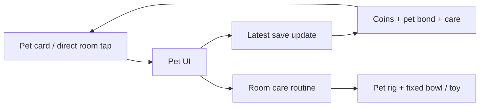

# Pet care implementation and review

The pet stays in the room while the player interacts with it. A compact card occupies the timer column on desktop. On phones, the room remains visible above the scrolling card. The header's focus control returns to the timer.

## The care loop

Focus earns coins and hearts for the pet captured when the session starts. A meal costs five coins, gives one heart, and starts twenty minutes of fullness. Play is free and earns a heart every twenty-five minutes. Petting remains free, including while a meal is in progress; its existing daily heart reward is preserved. Missing a day never reduces affection.

The player can name pets, choose unlocked ribbons, buy blanket/bowl fabrics once for fifteen coins, and switch owned fabrics freely. Invitations bring a pet near the player. The existing heart thresholds now unlock welcomes at eight hearts, naps at twenty-four, and a happy dance at sixty. Adoption preserves the saving target and lets the player name the new pet before welcoming it home.

## Data and rendering boundaries

`petBonds[id]` is the single player-pet relationship. Its `care` value owns saved meal/play deadlines, meal count, discovered foods and fabric ownership. `pet-care.js` normalizes imported data and defines the economy. `pet-bonds.js` grants hearts; `state.js` settles a due focus session and the requested purchase against the latest save in one synchronous update.

`pet-ui.js` checks that the room can receive a care action, performs the store update, then requests its animation. It preserves name drafts, open sections, focus and scroll through state updates. Coin balance and cooldown displays read the saved state; animation completion does not grant or spend currency.

The room routine owns an approach, active interaction and short contented pause. Meals have a fixed floor bowl and shrinking food. Play uses a room toy and bounded pet movement. Belongings share one material and four persistent meshes; only the blanket and bowl draw while idle. Changing a fabric updates geometry without adding mesh or material instances. Carrying or decorating clears temporary care, and changing motion preferences completes the approach without leaving a busy state behind.

Old pair friendship progress is retained only as a bounded legacy archive. Pair actions and focus rewards have been removed, and their hearts are not added to player-pet hearts. Existing names, currency, ribbons, preferences and captured focus ownership survive reload and backup. The removed Memory display has no replacement activity log.

## Independent review

One independent reviewer examined the uncommitted implementation. Both findings were accepted:

- Reduced motion enabled during the walk to a bowl could clear the path while leaving care busy forever. The routine now resolves the arrival; the room schedules a wake to finish care. A unit regression and room harness cover the setting change.
- A feeding transaction that settled a focus deadline could start automatic play before the paid meal animation. Completion now gives an affectionate reaction, which leaves the explicit care action available. A browser test feeds exactly at the deadline and verifies one meal, one session, the correct coins, and the treat routine.

No findings were dismissed, and no further reviewers were spawned. The primary agent performed the research, implementation and visual inspection.

## Final refinements

A CI care flow exposed a real interaction race: updating a cooldown minute replaced the card between mouse-down and mouse-up. Cooldowns now update their labels in place. A browser regression holds a real mouse press over the belongings control while advancing the clock, then verifies that it opens and preserves a name draft. The lh driver also rejects controls inside closed details before attempting a click.

Visual inspection found downward-facing blanket normals, which made its fabric dark. Corrected triangle winding restores the gingham, and a geometry test checks the normals. Invitations now choose a reachable spot beside a seated player before the desk; a routine test covers both sitting and napping beside the daybed.

## Verification at the final checkpoint

- 215 unit tests, including malformed care imports, cooldowns after reload/backward clocks, duplicate/stale-tab purchases, backups and captured focus ownership.
- All 20 Playwright tests passed locally, including accessibility, phone room visibility, naming drafts across tabs, focus completion, switching room views and the cooldown click regression. Final CI status is recorded on the PR.
- Room harness, production build and guard passed. The build retains its existing large-chunk warning; NullEngine's skeletal uniform warnings are not a real GPU result.
- 159 checks passed across the care, pet, controls, avatar, timer and door flows. The thirty-check care flow also passed with SwiftShader and CI timing. Inputs are real clicks/keys; the test hook reads state and geometry.
- Desktop and phone visuals inspected in the in-app browser and in saved screenshots. The same-seed before/after is `.lh/out/2026-09-28T08-02-53-shot/`; final corrected fabric and invitation evidence is `.lh/out/2026-09-28T08-15-25-shot/pet-this.jpg`. Care action evidence is `.lh/out/2026-09-28T07-59-44-run/`.
- Four alternating Metal performance rounds against main: 59.8 FPS on both, p95 frame gap 16.8 ms on both, no slow frames or page errors. Median idle CPU: 115.5 versus 111.0 ms/s (within the harness's ±10 ms/s variation). GPU: 2.40 versus 2.25 ms. Idle draw calls: 148 versus 146. Evidence: `.lh/out/2026-09-28T08-03-53-perf/perf.json`.

- Thirty-cycle heap comparison passed on both revisions. Working tree: 62.0 → 62.9 → 63.2 MB, with 17.8 KB/cycle growth in the measured second half (64 KB limit); main: 60.8 → 61.9 → 62.2 MB, 19.3 KB/cycle. Meshes, materials, geometries, textures, engines and canvases remained stable across cycles. Evidence: `.lh/out/2026-09-28T08-05-20-heap/`.

Performance and heap measurements compare implementation commit 5a29332 with main bf3159d. The final label, winding and invitation changes add no meshes, materials or render work. The first PR run exposed the cooldown race above and two browser timeouts; the concurrent push run passed. Final-head CI must pass before handoff; consult the PR checks for the authoritative result.

This is a browser game change; App Store distribution and audience/retention validation are outside this PR, and no virality claim is made.
